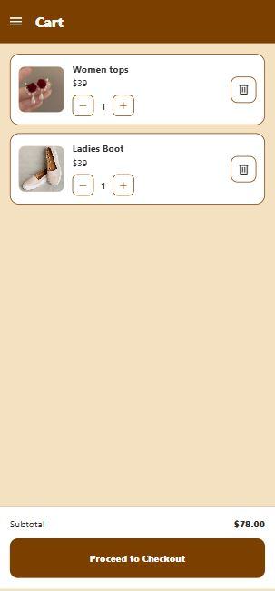
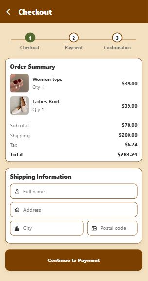

# 👗 Garments Store App

A scalable **Garments Store mobile application** built with **React Native & Expo**, designed to simulate a real-world e-commerce shopping experience with dynamic cart management, modular architecture, and clean state handling.

---

## 🚀 Project Overview

This project demonstrates:

- Real-world mobile e-commerce flow  
- Structured component architecture  
- State management using Context API  
- Dynamic pricing & cart synchronization  
- Clean navigation using React Navigation  

It reflects production-level thinking in terms of UI separation, reusable components, and predictable state updates.

---

## 📱 Screenshots

<p align="center">
  
  
  
  
  
  
  
  
  
  
</p>

---

## 🛍️ Core Features

- 👕 Product listing with category display  
- 📄 Detailed product screen with dynamic data  
- 🛒 Add to cart with quantity management  
- ➕ Increment / decrement item count  
- 💰 Automatic real-time total calculation  
- 🔄 Centralized cart state management  
- 📱 Smooth stack navigation  

---

## 🏗️ Architecture Highlights

- Component-based structure for maintainability  
- Context API for centralized cart state  
- Reusable UI components  
- Separation of UI & business logic  
- Scalable folder organization  

This structure allows easy extension for backend integration, payment gateway, and authentication systems.

---

## 🛠️ Tech Stack

- React Native  
- Expo CLI  
- React Navigation  
- Context API  

---

## ⚙️ Installation & Setup

```bash
git clone https://github.com/Mamoona786/GarmentsStoreApp.git
cd GarmentsStoreApp
npm install
npx expo start
